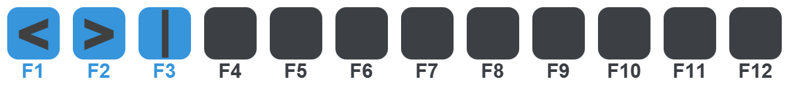

# JMacros

JMacros allows you to create hotkeys, macros and scripts in a fast and easy way to make your life more convenient.  
It is good-looking, platform independent and extremely versatile.

JMacros aims to solve the problems many other hotkey/macro solutions have:  
You don't have to memorize hotkeys, don't have to buy expensive gear (I'm looking at you [elgato stream deck](https://www.elgato.com/de/stream-deck) 👀)
and it's not as stubborn as [AutoHotkey](https://www.autohotkey.com/), while being as versatile as the competitors.

### ⚠️ Note

**This is currently only an early proof of concept. It's still missing many of the planed features.**
**The code is unorganized, buggy and full of FIXME notes and TODOs.**

## How it works

Your keyboard probably has a key that you don't really use. `CAPS LOCK`, `MENU` or `ROLL` are good candidates.  
This key (`CAPS LOCK` by default) can be used to open (or close) the JMacros overlay.  
If the overlay is opened, you can use the function keys to run one of 12 predefined macros.  
The overlay also supports touch input if you are that fancy.  

But you probably want more than just 12 Hotkeys. That's why profiles exist (⚠️ _still Work in Progress_). 
You can organize up to 12 Hotkeys in one profile and cycle through them as needed or create a folder structure.  

There will also be an API to create your own Macros using java code. 

## Install & Build

If you want to test it, download the latest build from the [releases page](https://github.com/joblo2213/JMacros/releases) and run the start script.

You will need **Java 11 or newer** to run it.

Alongside the download comes a example configuration to get started. The scripts run JMacros in portable mode where the configs can be placed in the same location as the jar.  
In default mode all configs are saved to `~/.jmacros`.  

If you want to build the sources on your own you'll need maven. Run `mvn clean package` in the project root directory. The final JAR will be created in `core/target/`.
